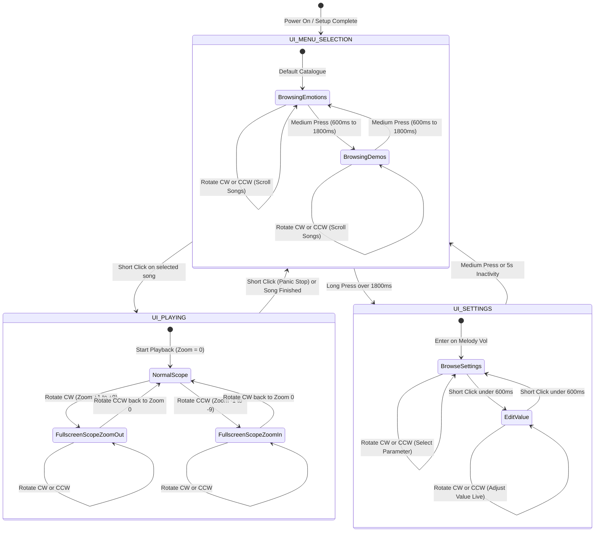
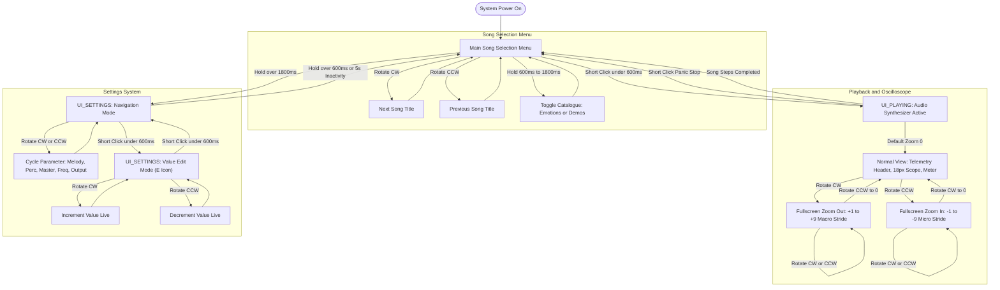

# OLED Display & UI Navigation Manual

A technical reference for the 128x32 monochrome SSD1306 OLED display interface and rotary encoder navigation system used in the Sound Messenger with AM Modulation via PWM.

---

## 1. Physical Hardware & Display Geometry

### 1.1 Display Specifications
* **Controller**: Solomon Systech SSD1306
* **Interface**: I²C (`0x3C` / `0x3D`)
* **Resolution**: 128 horizontal columns × 32 vertical rows (4,096 binary pixels)
* **Refresh Architecture**: Double-buffered GDDRAM flushed over I²C during ring-buffer full idle intervals (~25 FPS to 60 FPS)
* **Glyph Matrix**: 5×7 dot-matrix font with 1-pixel inter-character spacing (6×8 pixel bounding box per character; 21 characters maximum per line)

```
        Column 0                                                     Column 127
Row 0   +---------------------------------------------------------------------+
        | LINE 0 (Rows 0-7): Header, Icons, Song Indices, Telemetry           |
Row 8   +---------------------------------------------------------------------+
        | LINE 1 (Rows 8-15): Waveform Display / Parameter Sliders            |
Row 16  +---------------------------------------------------------------------+
        | LINE 2 (Rows 16-23): Waveform Center / Status Boxes / Bar Graphs    |
Row 24  +---------------------------------------------------------------------+
        | LINE 3 (Rows 24-31): Level Meters / Numeric Readouts                |
Row 31  +---------------------------------------------------------------------+
```

### 1.2 Input Control Interface
User navigation is performed entirely using a single **rotary encoder with integrated push button** (KY-040 with full Ben Buxton quadrature state-machine debouncing):

| Control Input | Duration / Action | Function in Menu Mode | Function in Playback Mode | Function in Settings Mode |
| :--- | :--- | :--- | :--- | :--- |
| **Rotate Clockwise (CW)** | 1 detent step | Next Song in catalogue | Zoom Out scope (+1 to +9) | Next setting / Increment value |
| **Rotate Counter-Clockwise (CCW)** | 1 detent step | Previous Song in catalogue | Zoom In scope (-1 to -9) | Prev setting / Decrement value |
| **Short Press** | $< 600\text{ ms}$ | Start song playback | Emergency Stop playback | Toggle Item Browse $\leftrightarrow$ Value Edit |
| **Medium Press (Hold)** | $600\text{ ms} - 1800\text{ ms}$ | Toggle Catalogue (Emotions $\leftrightarrow$ Demos) | Emergency Stop playback | Exit Settings to Menu |
| **Long Press (Hold)** | $> 1800\text{ ms}$ | Enter Settings Menu | Emergency Stop playback | Exit Settings to Menu |
| **Inactivity Timeout** | $5000\text{ ms}$ idle | None | None | Auto-exit Settings to Menu |

---

## 2. Navigation State Machine



---

## 3. Screen Reference & Visual Layouts

---

### Screen 1: Song Selection Menu (Catalogue: 20 Emotions)

#### Description
The resting default screen upon boot or sequence completion. The top row features the 8-pixel music note glyph (`♫`), two-digit song index, truncated 14-character song title, and a right-aligned play triangle (`▶`). The middle divider separates the song area from hardware monitor boxes. The bottom area displays the live status of the physical front-panel fields: RF carrier status (`ON`/`OFF`), audio DAC status (`ON`/`OFF`), a 10-segment master volume bar, and the active AM carrier frequency in kHz.

#### ASCII Pixel Layout
```
 0        11   14             28                                   120   127
+-----------------------------------------------------------------------+
| [♫]  01 Melancholia                                                [▶]|  Row 0-8
|-----------------------------------------------------------------------|  Row 10
|                                                                       |
|  [ON]     [ON]      [====|    ]  16             594                   |  Row 18-28
+-----------------------------------------------------------------------+
   RF      AUDIO         VOLUME         LEVEL       AM FREQ (kHz)
```

#### Field Layout Table
| Region | Coordinates ($X, Y$) | Dimension | Content / Value | Purpose |
| :--- | :--- | :--- | :--- | :--- |
| **Catalogue Icon** | $(0, 0)$ | $8 \times 8\text{ px}$ | Music Note glyph (`♫`) | Identifies active Emotion Catalogue |
| **Song Index** | $(11, 0)$ | 2 chars | `01` to `20` | Current song index in catalogue |
| **Song Title** | $(25, 0)$ | 14 chars max | e.g. `Melancholia` | Truncated song title |
| **Play Icon** | $(120, 0)$ | $8 \times 8\text{ px}$ | Filled triangle (`▶`) | Cue indicating playback starts on click |
| **Separator** | $(0, 10)$ to $(127, 10)$ | $128 \times 1\text{ px}$ | Solid horizontal line | Optical divide between selection and hardware |
| **RF Output Box** | $(0, 18)$ | Text string | `ON` or `OFF` | Indicates whether RF PWM carrier is active |
| **Audio DAC Box** | $(20, 18)$ | Text string | `ON` or `OFF` | Indicates whether DAC A0 monitor is active |
| **Volume Bar** | $(40, 18)$ | $49 \times 6\text{ px}$ | 10 dual-step segments | Master volume graphic bar (with cursor) |
| **Volume Value** | $(88, 18)$ | 2 chars | `0` to `20` | Master volume numeric level |
| **AM Carrier Freq** | $(103, 18)$ | 4 chars | `531` to `1602` | Carrier frequency in kHz |

---

### Screen 2: Song Selection Menu (Catalogue: 29 Demos)

#### Description
Triggered by holding the rotary encoder button between **600 ms and 1800 ms** while on the selection screen. The music note glyph is replaced by a solid letter **`D`**, indicating that the 29-song feature showcase catalogue (`DEMO_SONGS[]`) is active. Selecting and playing demos routes through the identical synthesizer and monitoring engines.

#### ASCII Pixel Layout
```
 0        11   14             28                                   120   127
+-----------------------------------------------------------------------+
|  D   04 Arpeggio Show                                              [▶]|  Row 0-8
|-----------------------------------------------------------------------|  Row 10
|                                                                       |
|  [ON]     [ON]      [====|    ]  16             594                   |  Row 18-28
+-----------------------------------------------------------------------+
   RF      AUDIO         VOLUME         LEVEL       AM FREQ (kHz)
```

#### Field Layout Table
| Field | Coordinates | Dimension | Content | Purpose |
| :--- | :--- | :--- | :--- | :--- |
| **Demo Identifier** | $(0, 0)$ | $6 \times 8\text{ px}$ | Glyph `D` | Identifies active Feature Demo Catalogue |
| **Demo Index** | $(11, 0)$ | 2 chars | `01` to `29` | Index within the demo suite |
| **Demo Title** | $(25, 0)$ | 14 chars max | e.g. `Arpeggio Show` | Truncated demo showcase title |

---

### Screen 3: Playback Mode – Normal Oscilloscope View (Default, Zoom 0)

#### Description
Active immediately when playback begins. Shows a dense telemetry dashboard paired with an 18-pixel real-time waveform window and a bottom level meter:
* **Rows 0–6 (Telemetry Header)**: Peak percentage (`P<val>`), RMS power percentage (`R<val>`), active voice count (`V<count>`), dominant frequency readout (`xxxHz` / `x.xkHz`), and overload alert box (`!`).
* **Rows 8–25 (Waveform Display)**: $\pm 8\text{ px}$ amplitude range centered at Row 17, featuring horizontal dashed center-line markers and min/max envelope decimation vectors.
* **Rows 27–31 (Audio Level Meter)**: 5-pixel horizontal bar displaying live RMS fill with an instantaneous peak marker.

#### ASCII Pixel Layout
```
 0       8        17       26                          72          118   127
+-----------------------------------------------------------------------+
| P42     R18      V3                                  440Hz        [!] |  Row 0-6
|                                                                       |
|                     /\                /\                              |  Row 8-25
| - - - - - - - - - -/--\ - - - - - - -/--\ - - - - - - - - - - - - - - |  (Center Y=17)
|                   /    \      /\    /    \      /\                    |  Waveform
|                         \____/  \__/      \____/  \__/                |
|                                                                       |
| [===================|                                                ]|  Row 27-31
+-----------------------------------------------------------------------+
   RMS Power Fill     Peak Marker
```

#### Field Layout Table
| Region | Coordinates | Format / Value | Description |
| :--- | :--- | :--- | :--- |
| **Peak Telemetry** | $(0, 0)$ | `P` + integer ($0-100$) | Peak audio amplitude percentage across capture window |
| **RMS Telemetry** | $(17, 0)$ | `R` + integer ($0-100$) | Root-Mean-Square signal energy percentage |
| **Voice Count** | $(34, 0)$ | `V` + integer ($0-4$) | Active sounding melodic ADSR voices + active percussion |
| **Frequency Readout** | $(72, 0)$ | `--Hz` / `xxxHz` / `x.xkHz` | Zero-crossing dominant periodicity estimate |
| **Clipping Alert** | $(118, 1)$ | Inverted `!` box | Inverted solid block warning when peak $\ge 95\%$ |
| **Waveform Window** | $X: 0-127, Y: 8-25$ | 128 points, $Y_{\text{center}}=17$ | Quantized $\pm 8\text{ px}$ waveform with envelope decimation |
| **Center Reference** | Every 8th pixel on $Y=17$ | $1 \times 1\text{ px}$ dotted axis | Zero-crossing reference line |
| **Level Meter** | $X: 0-127, Y: 27-31$ | $126 \times 5\text{ px}$ framed box | Horizontal RMS fill bar and $1\text{ px}$ vertical peak indicator |

---

### Screen 4: Playback Mode – Fullscreen Oscilloscope (Zoom In, Level -1 to -9)

#### Description
Activated by rotating the encoder counter-clockwise during playback. Zoom level changes to negative values ($-1$ to $-9$). 
* **Columns 0–123**: The waveform expands to use the **full 32-pixel screen height** ($\pm 15\text{ px}$ amplitude centered at Row 16), revealing microscopic transient details and single carrier cycles.
* **Columns 124–127**: The rightmost 4 columns are dedicated to a dual vertical sound-power bar (vertical RMS column fill and horizontal peak line marker).
* **Decimation Stride**: Reduces additively down to $1\text{ sample per point}$ (single-sample raw resolution).

#### ASCII Pixel Layout
```
 0                                                         123  124  127
+-------------------------------------------------------------+----+----+
|                  /\                                         |    |    |
|                 /  \                                        |    |----| <- Peak Marker
|                /    \                                       |    |    |
| - - - - - - - / - - -\- - - - - - - - - - - - - - - - - - - |    |    | (Center Y=16)
|              /        \                                     |    |####|
|             /          \                                    |    |####| <- RMS Column
|            /            \__________                         |    |####|
|           /                        \                        |    |####|
+-------------------------------------------------------------+----+----+
   124-Column Full-Height Waveform Area                         Meter Area
```

---

### Screen 5: Playback Mode – Fullscreen Oscilloscope (Zoom Out, Level +1 to +9)

#### Description
Activated by rotating the encoder clockwise during playback. Zoom level changes to positive values ($+1$ to $+9$).
* **Columns 0–123**: Expands to full 32-pixel height, rendering multiple musical measures, rhythmic transients, and delay echoes.
* **Decimation Stride**: Increases additively by $+5\text{ samples/point}$ per step up to $45\text{ samples/point}$ at level $+9$ ($360\text{ ms}$ capture window), preventing frame freezes while capturing long-term envelope dynamics.
* **Min/Max Vertical Decimation**: For each horizontal pixel column, vertical lines are rendered connecting the interval's minimum and maximum samples, preserving sharp percussion transients.

#### ASCII Pixel Layout
```
 0                                                         123  124  127
+-------------------------------------------------------------+----+----+
|   ||   /\     ||   /\     ||   /\     ||   /\     ||   /\     |    |----| <- Peak Marker
|  |||| /  \   |||| /  \   |||| /  \   |||| /  \   |||| /  \    |    |    |
| -||||/----\--||||/----\--||||/----\--||||/----\--||||/----\---|    |    | (Center Y=16)
|  ||||      \-||||      \-||||      \-||||      \-||||      \--|    |####|
|   ||        \ ||        \ ||        \ ||        \ ||        \ |    |####| <- RMS Column
|              \|          \|          \|          \|          \|    |####|
+-------------------------------------------------------------+----+----+
   Wide Rhythmic View with Min/Max Envelope Preservation        Meter Area
```

#### Fullscreen Stride Calculation Table
$$S_{\text{stride}} = S_{\text{base}} \pm (M - 1) \times 5$$

| Zoom Level | Mode Name | Stride ($\text{samples/point}$) | Total Window Time ($16\text{ kHz}$) | Visual Focus |
| :---: | :---: | :---: | :---: | :--- |
| **$-9$ to $-2$** | Zoom In (Microscopic) | $1\text{ smp/pt}$ (clamped) | $8.0\text{ ms}$ | Single-cycle waveforms, phase alignment, FM transients |
| **$-1$** | Fullscreen Normal Base | $5\text{ smp/pt}$ | $40.0\text{ ms}$ | Full-height view at standard $40\text{ ms}$ time-base |
| **$0$** | **Default Normal View** | **$5\text{ smp/pt}$** | **$40.0\text{ ms}$** | **Dual Status Header + 18px Scope + Horizontal Level Bar** |
| **$+1$** | Fullscreen Normal Base | $5\text{ smp/pt}$ | $40.0\text{ ms}$ | Full-height view at standard $40\text{ ms}$ time-base |
| **$+2$** | Zoom Out (Level 2) | $10\text{ smp/pt}$ | $80.0\text{ ms}$ | Syllables, fast arpeggios, percussion decay envelopes |
| **$+4$** | Zoom Out (Level 4) | $20\text{ smp/pt}$ | $160.0\text{ ms}$ | Note transitions, delay repeats |
| **$+6$** | Zoom Out (Level 6) | $30\text{ smp/pt}$ | $240.0\text{ ms}$ | Half-measure phrases, rhythmic bass pulses |
| **$+9$** | Zoom Out (Maximum) | $45\text{ smp/pt}$ | $360.0\text{ ms}$ | Full rhythmic bars, macroscopic amplitude dynamics |

---

### Screen 6: Settings Menu – Navigation Mode (Browsing Parameters)

#### Description
Accessed by holding the rotary encoder button for $> 1800\text{ ms}$ from the main menu. Shows parameter titles with a navigation caret (`>`). Turning the encoder cycles through the five configurable hardware parameters in circular order:
1. `MELODY VOL`
2. `PERC VOL`
3. `MASTER VOL`
4. `AM FREQUENCY`
5. `OUTPUT`

#### ASCII Pixel Layout (Browsing Master Volume)
```
 0       8 9                                                       127
+-----------------------------------------------------------------------+
| >       MASTER VOL                                                    |  Row 0-7
|-----------------------------------------------------------------------|  Row 8
|                                    ▼                                  |  Row 10 (Marker)
|         [==========================|                    ]             |  Row 14-18 (Track)
|                                                                       |
| 0                                  16 / 20                         20 |  Row 22-31
+-----------------------------------------------------------------------+
```

#### Field Layout Table
| Region | Coordinates | Content | Description |
| :--- | :--- | :--- | :--- |
| **Mode Indicator** | $(0, 0)$ | Caret symbol (`>`) | Indicates navigation mode (rotating moves between settings) |
| **Setting Title** | $(9, 0)$ | Parameter Name string | Name of the currently selected setting item |
| **Divider Line** | $(0, 8)$ to $(127, 8)$ | Solid horizontal rule | Separates title header from parameter editor |
| **Triangle Marker** | $(X_{\text{val}}, 10)$ | Downward filled triangle | Positions above the slider track to indicate setting value |
| **Slider Track** | $X: 8-119, Y: 14-18$ | $112 \times 5\text{ px}$ frame | Continuous min-to-max slider bar with filled progress |
| **Minimum Boundary** | $(0, 22)$ | `0` (or `531 kHz`) | Lower boundary label |
| **Maximum Boundary** | $(117, 22)$ | `20` (or `1602 kHz`) | Upper boundary label |
| **Current Value Readout** | $(48, 24)$ | `16 / 20` | Centered exact numeric value |

---

### Screen 7: Settings Menu – Value Edit Mode (Editing Parameter)

#### Description
Activated by a short click ($< 600\text{ ms}$) on any setting in Navigation Mode. The navigation caret (`>`) is replaced by an **inverted solid white block with the letter `E`** (`[E]`). Rotating the encoder now modifies the selected parameter live in real-time. A second short click commits the value and returns to Navigation Mode.

#### ASCII Pixel Layout (Editing Melody Volume)
```
 0       8 9                                                       127
+-----------------------------------------------------------------------+
| [E]     MELODY VOL                                                    |  Row 0-7
|-----------------------------------------------------------------------|  Row 8
|                                               ▼                       |  Row 10 (Marker)
|         [=====================================|         ]             |  Row 14-18 (Track)
|                                                                       |
| 0                                  18 / 20                         20 |  Row 22-31
+-----------------------------------------------------------------------+
```

---

### Screen 8: Settings Menu – AM Carrier Frequency Editor

#### Description
Adjusts the RF PWM carrier frequency for wireless AM transmission. Clamped to the European Medium Wave (MW) broadcast band ($531\text{ kHz}$ to $1602\text{ kHz}$) in standard $9\text{ kHz}$ ITU Region 1 tuning increments. Adjusting this setting immediately updates the hardware timer period and rebuilds the 513-point arcsine predistortion lookup table (`lut_asin_duty`) to eliminate harmonic distortion.

#### ASCII Pixel Layout
```
 0       8 9                                                       127
+-----------------------------------------------------------------------+
| [E]     AM FREQUENCY                                                  |  Row 0-7
|-----------------------------------------------------------------------|  Row 8
|                      ▼                                                |  Row 10 (Marker)
|         [============|                                  ]             |  Row 14-18 (Track)
|                                                                       |
| 531 kHz                            594 kHz                   1602 kHz |  Row 22-31
+-----------------------------------------------------------------------+
```

---

### Screen 9: Settings Menu – Output Routing Selector

#### Description
Configures physical audio routing using a 4-segment segmented pill selector. The active mode is highlighted as an inverted solid white box with black text:
1. `AUDIO` (DAC A0 only, RF carrier transmitter off)
2. `RF` (RF AM carrier on, DAC held at idle midpoint $2048$)
3. `A+RF` (Both Audio DAC monitor and RF AM carrier live; default)
4. `MUTE` (Both DAC and RF carrier silenced)

#### ASCII Pixel Layout
```
 0       8 9                                                       127
+-----------------------------------------------------------------------+
| >       OUTPUT                                                        |  Row 0-7
|-----------------------------------------------------------------------|  Row 8
|                                                                       |
|         +----------+----------+##########+----------+                 |  Row 12-20
|         |  AUDIO   |    RF    |  A+RF    |   MUTE   |                 |  (Segmented Box)
|         +----------+----------+##########+----------+                 |
|                                                                       |
|                                3 AUDIO + RF                           |  Row 24-31
+-----------------------------------------------------------------------+
```

#### Output Mode Matrix
| Mode Index | Short Label | Full Name | DAC Monitor Pin (A0) | RF Carrier Pin (D9) | Predistortion LUT |
| :---: | :---: | :---: | :---: | :---: | :---: |
| **0** | `AUDIO` | `AUDIO ONLY` | Active ($0-4095$) | Suspended / Low | Standby |
| **1** | `RF` | `RF ONLY` | Idle ($2048$) | Active (PWM Modulated) | Active |
| **2** | `A+RF` | `AUDIO + RF` | **Active ($0-4095$)** | **Active (PWM Modulated)** | **Active** |
| **3** | `MUTE` | `MUTE` | Idle ($2048$) | Suspended / Low | Suspended |

---

## 4. Complete Menu Navigation Map



---

## 5. Technical Design Notes

1. **Flicker-Free Rendering**: The OLED display routine executes outside interrupt context during ring-buffer full intervals (`audioBufferHasSpace() == false`). This guarantees that multi-byte I²C transmissions never starve the $16.0\text{ kHz}$ audio interrupt service routine (`cb_audio`).
2. **Logarithmic Volume Tapering**: Levels $1$ to $20$ are mapped along a $-45\text{ dB}$ to $0\text{ dB}$ logarithmic audio-taper curve, matching human hearing perception. Level $0$ enforces a digital hard mute.
3. **Double-Buffered Waveform Memory**: Scope data is continuously acquired into `wave_capture_buf` and committed atomically to `display_wave_buf` upon completing 128 points, ensuring 60 FPS animations with zero visual tearing.
4. **Single-Line Text Enforcement**: All text labels are truncated using `truncateTitleForDisplay()` to fit within the 21-character line limit, preventing glyph wrapping from disrupting graphical screen coordinates.
